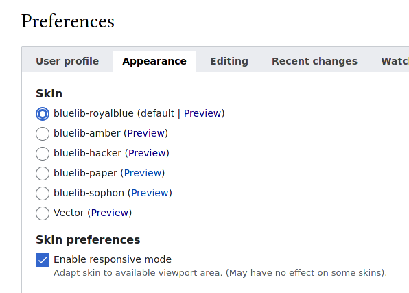
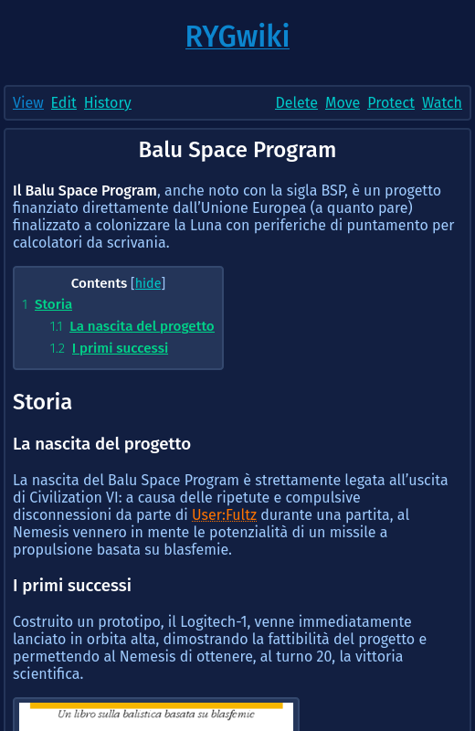
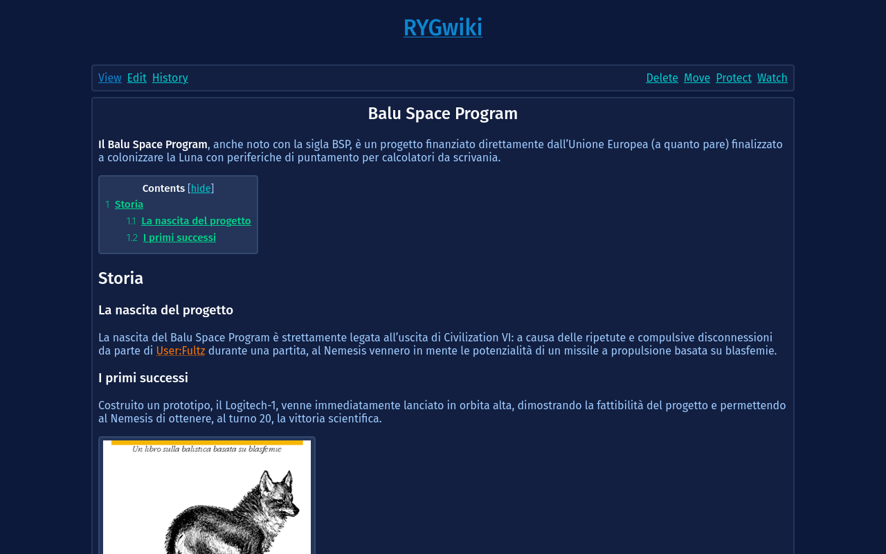
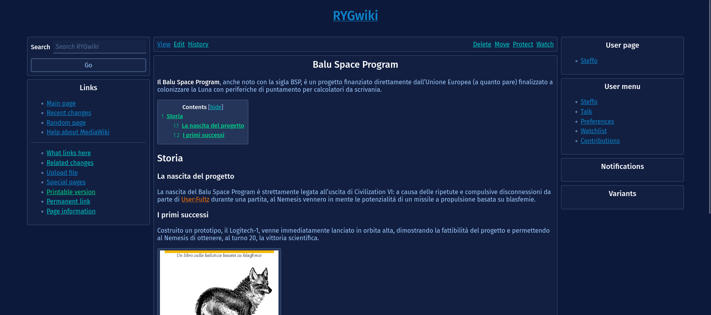

# Bluelib for MediaWiki

This [MediaWiki][mediawiki] plugin adds [Bluelib][bluelib]-based skins to a wiki.

## Download

To download this skin, clone this repository as `Bluelib` in the `skins/` directory.

```console
wiki:/var/www/mediawiki/skins$ git clone "https://github.com/RYGhub/mediawiki-skins-Bluelib.git" Bluelib 
```

## Installation

To install this skin, add the following line to your `LocalSettings.php`:

```php
wfLoadSkin( 'Bluelib' );
```

### _Optional: set as default_

To set one of the skins provided by this package as default, change the following line in your `LocalSettings.php`:

```php
# Replace "royalblue" with the name of your preferred bluelib theme
$wgDefaultSkin = "bluelib-royalblue"
```

## Usage

Once installed, if not set as default, visit your Preferences page, then select the desired skin in the Appearence tab.



## Screenshots




